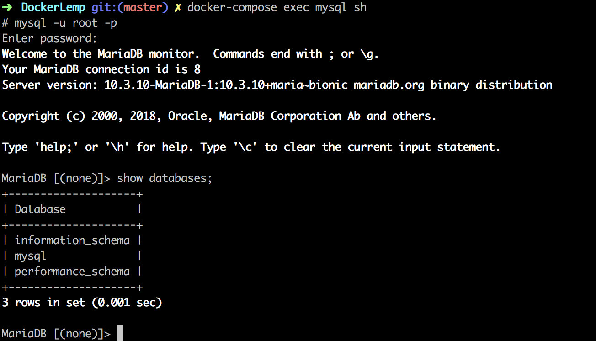

# Docker LEMP Stack
> basic Setup of LEMP Stack

- Nginx
- MySql
- Php 7.2
- Phpmyadmin


To run the containers 
```
docker-compose up -d
docker ps 
```

To Stop all the containers
```
docker-compose stop
```

To remove all the containers 
```
docker-compose rm --all
```

---

To ssh to a container 
> I'll ssh to mysql
```
docker-compose exec mysql sh

$ mysql -u root -p
```


---
